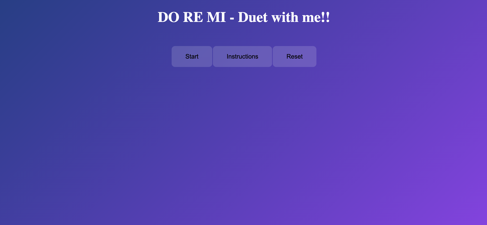
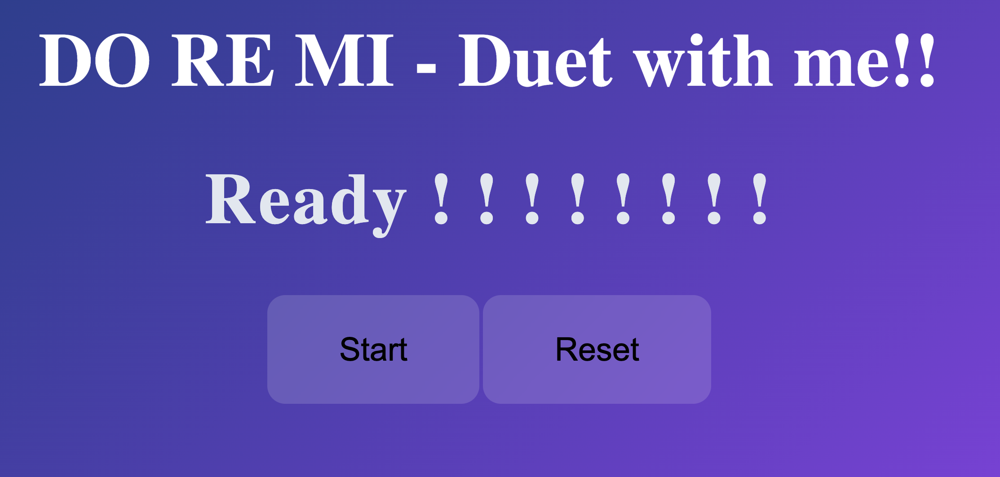
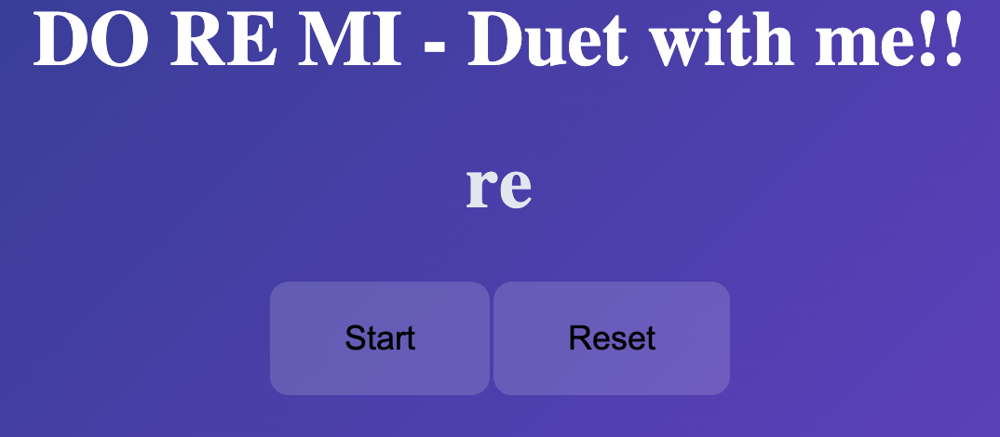
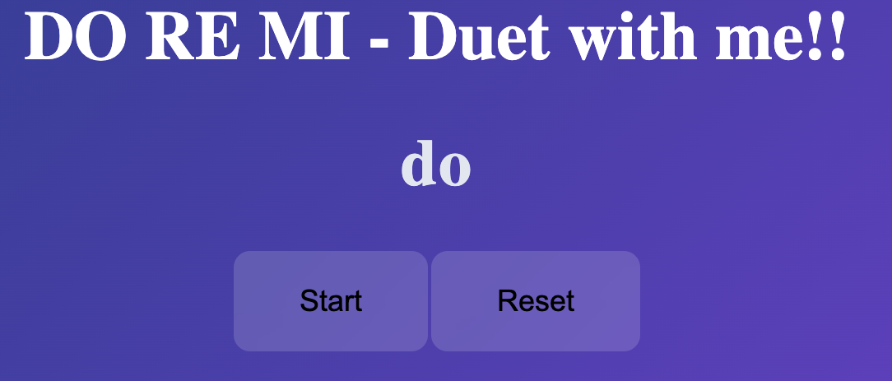
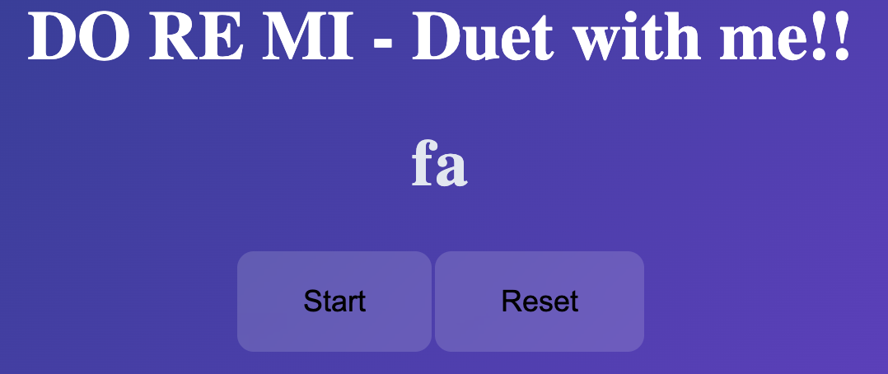
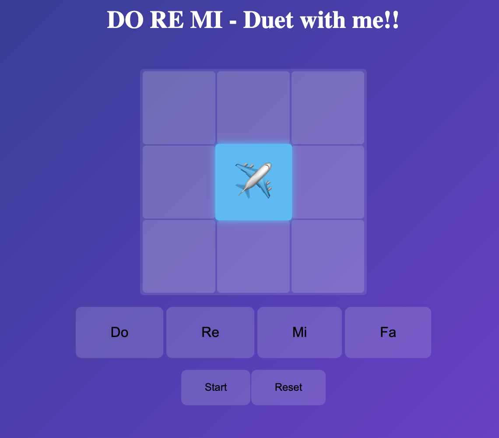
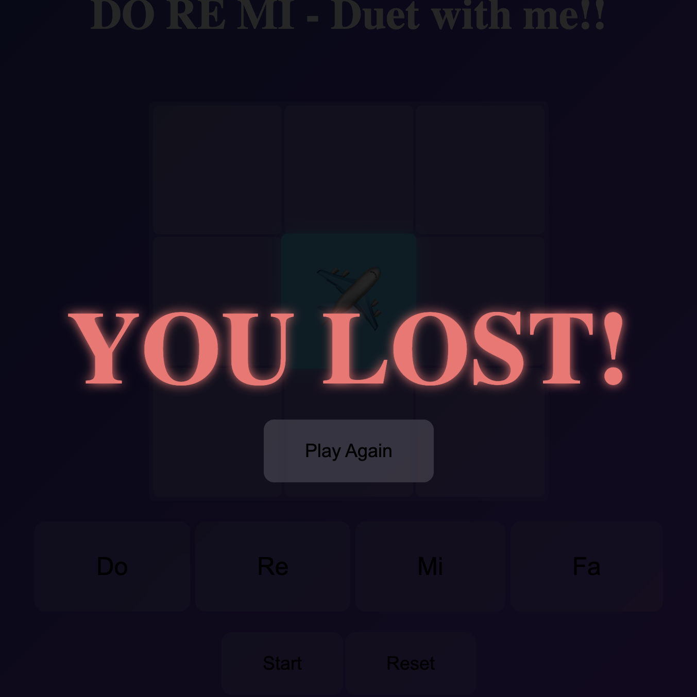

## 🎵 Do re mi! - Duet with me! 🎵

### Description

Do re mi is a browser-based game built using DOM manipulation techniques. Players are required to listen to a sequence of notes and repeat them correctly. The game consists of three rounds, and players must successfully complete each round to progress. The difficulty increases as the game advances. The objective of the game is to help players recognise and develop familiarity with basic musical notes.

### 🕹️ How to Play

1. Press the **"Start"** button to begin the game.
   They will hear a background music containing whistle with visual aid of "Ready ! ! ! ! ! ! ! !"

2. After hearing **"One, Two, Three"**, three random musical notes(**Do, Re, Me, Fa**) will be played.
3. Four options will then appear. Players must select the correct sequence of notes. Each selection will play the corresponding note as audio feedback.
4. If player selects all three notes correctly, they will proceed to the next round.
5. If player selects an incorrect notes at any point, the game ends and they will lose.
6. Players can click on **"Instructions"** for visually guidance.

### Game Demo (Walk Through)

- Select **"Start"**
  

- After "One, Two, Three" , player will see three notes being played one by one.
  
  
  

-Grid will appear and player pick the butons

-Pick the wrong sequence of note, player will see "You Lost!"

## ✨ Features

- Interactive sound-based gameplay
- Progressive difficulty across 3 rounds
- Real-time feedback (Win / Lose messages)
- DOM Manipulation
- Audio playback for musical notes

## 🛠️ Technologies Used

- HTML
- CSS
- JavaScript (DOM Manipulation)

## 📚 Key Learning

- Gained confidence in implementing functionality using JavaScript
- Developed a better understanding of DOM manipulation and event handling
- Learned how to handle user input and provide dynamic feedback
- Improved ability to structure and organise functions effectively
- Recognised the importance of building basic visuals and core functionality first before expanding features

## 🚀 Future Improvement

- Add keyboard controls to enhance the gameplay experience
- Include more soud effects and visual animations
- Introduce additional rounds with increased difficulty
- Implement a score tracking system
- Add a timer to increase the game's intensity and engagement

Last updated: 18 April 2026
